Bakhtiyarpur College of Engineering

BROCHURE ‘22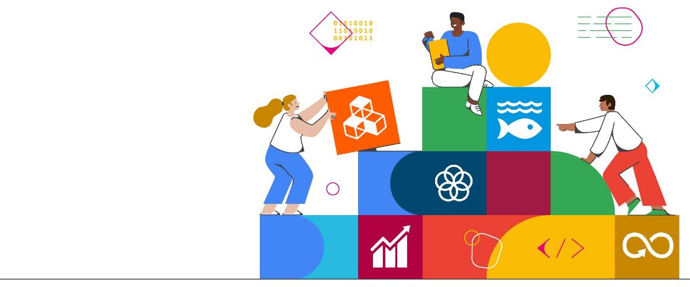

**Table of Contents**

- What is the Solution Challenge ?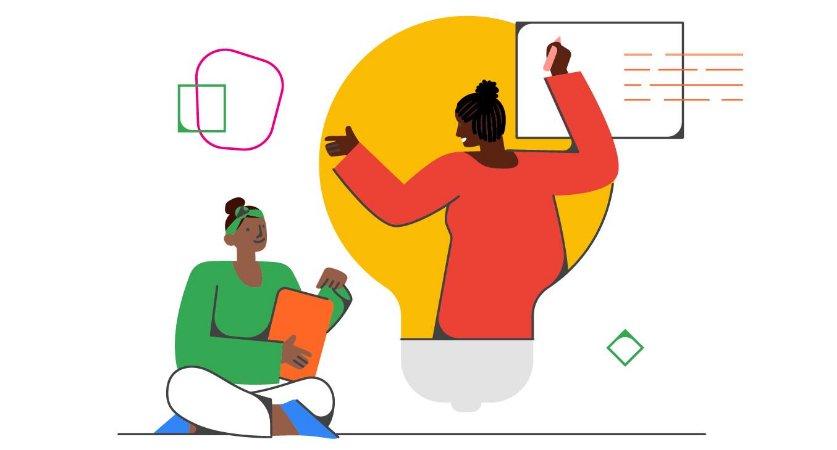
- UN 17 SDGs
- Process
- Prizes
- Judging Criteria
- Timeline
- FAQs
- Winners ’21

**What is the Solution Challenge?**

Have you ever felt inspired to build something that can help improve the lives of those you care about? Google Solution Challenge brings you the golden & global oppounity for the same.

The Google Solution Challenge is an annual contest where you can show your skills by developing a solution that solves and addresses one or more of the United Nations’ 17 Sustainable Development Goals using one or more Google products or plaorms.

The year ahead brings more oppounities for helping each other and giving back to our communities.

With that in mind, we invite students around the world to join the Google Developer Student Clubs 2022 Solution Challenge!

This year, see how you can use Android, Firebase, TensorFlow, Google 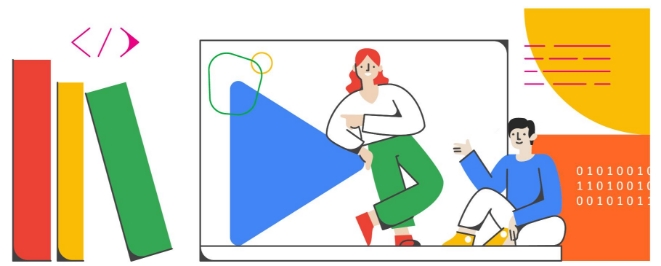Cloud, Fluer, or any of your favourite Google technologies to promote employment for all, economic growth, and climate action, by building a solution for one or more of the UN Sustainable Development Goals.

**UN 17 Sustainable Development Goals**

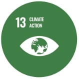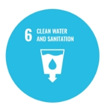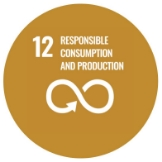

**The Complete Process**

Geing Staed

Step 1: Join a Google Developer Student Club

Step 2: Register for the 2022 Solution Challenge by submiing this form. Step 3: Form a team (maximum 4 members)

Step 4: Select a United Nations Sustainable Development Goal

Design & Build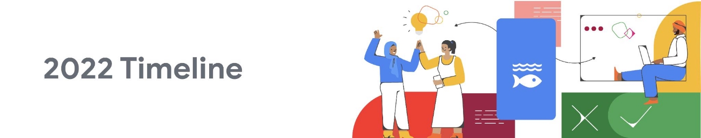

Step 5: Identify a Solution

Step 6:

- Learn & build Design the front-end inteace
- Design the back-end technology

Step 7: Test your solution

Step 8: Iterate Submissions & Judging

Step  9:  Record a demo video and submit by March 31st, 2022 Step 10: Top 50 solutions announced (mid-April)

Step 11: Top 50 mentoring (May)

Step 12: Top 10 nalists announced (June)

Step 13: Top 3 winners announced live on YouTube (July)

Step 14: Celebrate all the 2022 Solution Challenge paicipants!

 **Prizes**

**All paicipants receive a Google Developers digital prole badge**

**and an ocial ceicate.**

**Top 50 teams**

Receive customised mentorship from Googlers and expes to take solutions to the next level, a branded T-shi, and a ceicate.

**Top 10 nalists**

Receive additional mentorship, a swag box, and the oppounity to showcase solutions to Googlers and developers all around the world at Demo Day live on YouTube.

**Contest Finalists**

In addition to the swag box, each individual from the additional seven recognized teams will receive a Cash Prize of **$1,000** per student.

Winnings for each qualifying team will not exceed **$4,000**.

**Top 3 winners**

In addition to the swag box, each individual from the top 3 winning teams will receive a Cash Prize of **$3,000** and a feature on the Google Developers Blog.

Winnings for each qualifying team will not exceed **$12,000**.

**Judging Criteria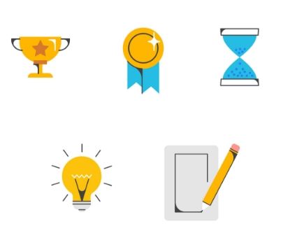**

A panel of judges from Google will use the following criteria to evaluate and score all submissions. …….…………………………………………………….……………………………………………………..

**IMPACT - 60 POINTS**

1. Does the entry establish a clear challenge focused on one or more of the United Nations 17 Sustainable Development Goals? Is it explained in a clear manner with specic Sustainable Development Goal targets they are looking to solve for? **[10]**
1. How eectively does the solution address the challenge identied by the team? **[20]**
1. Is there evidence of the next step? Does the team display a plan for future extension if they were to continue? **[10]**
1. Is there evidence that the solution has been thoroughly tested with real users? **[10]**
1. Is there evidence that the solution was iterated upon based on user feedback? **[10]**

**TECHNOLOGY - 40 POINTS**

1. Does the solution implement all the technical components needed to solve the challenge? **[10]**
1. Has the team clearly explained what Google technology they used, why and included guidance on how to run their code? **[10]**
1. Does the video demonstration show the working solution and how a user will interact with the solution? Does the demonstration highlight how the Google technologies are implemented and also mention the value the technology provides the users? **[10]**
1. Has the team made eective product and technical decisions for their solution? **[10]**

**Timeline               ...**

Last March

**Project Submission**

Put your solution into action. Record a video of a successful demo (maximum 2 minutes long) and submit it. **The submission form will open on March 15, 2022**.

Late April

**Top 50 Teams selected**

Aer judges review all submissions against the evaluation criteria, the top 50 Solution Challenge teams will be announced.

May

**Mentoring for top 50 teams**

The top 50 teams receive mentorship from Google and Google Developer Expes to improve their solution and resubmit it for the top prize.

June

**Top 10 finalists announced**

Finalist teams will be announced and begin to prepare for the 2022 Solutio[n Challenge Demo Day.](https://developers.google.com/community/gdsc-solution-challenge/gdsc-demo-day)

July 

**3 winning teams announced live on YouTube** 

All 10 nalists will showcase their solutions during the 2022 [Solution Challenge Demo Day, an](https://developers.google.com/community/gdsc-solution-challenge/gdsc-demo-day)d the 3 winning teams will be announced! 

**FAQs 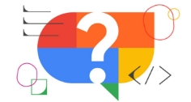**

- **Can my solution solve a problem outside of the scope of the 17 Sustainable Developer Goals?**

For Solution Challenge 2022, we **require** your submied solution to solve for at least one or more of the 17 SDGs. When you have submied your solution, please review all the 17 SD[Gs to ](https://sdgs.un.org/goals)understand which SDG your solution is focused on and what SDG targets you are looking to solve for.

- **Can one student or team submit with multiple submissions if they’ve contributed to both projects?**

No. The Terms and Conditions state “LIMIT ONE (1) ENTRY PER PERSON,” so each student can only be a pa of one submission.

- **Can I still paicipate in the Solution Challenge if there is no Developer Student Club at my university?**

Yes, as a student you can still paicipate as long as you team up with **at least one** student at an existing GDSC university. You must join the GDSC community through the GDSC [event plaorm.](http://dsc.community.dev/) We recommend you to then reach out to the GDSC lead for guidance on how to join or form a team with their community.

- **What is a Solution Demo? What should it feature?**

The solution demo is a demonstration video that shows the most impoant pa of your application. When evaluating, our judges will use the demonstration video to understand how a user will interact with the application.

Note that your video is limited to 2 minutes, so focus on what’s really impoant!

From the video, we want to understand how the user interacts with your application and its features. We don’t need to know about every lile feature detail, we care far more about the core value your solution is adding. So focus on the most impoant features and functionalities for the user.

- **In addition to Google’s developer tools, we used developer tools that were not created by Google. Does that still qualify?**

Yes. As per the T[erms and Conditions, we](https://developers.google.com/community/gdsc-solution-challenge/terms) require that your submissions “Use of one or more Google products or plaorms including.” In addition to that, however, you can also use developer tools that Google did not develop.

- **Does our project have to be deployed for submission?**

No, it does not have to be deployed. If the project is deployed, this will help our judges get a better understanding of what you’ve built, but it is not required.

- **The submission form asks us for a link to our repository. How can we share our code repo while also keeping our code private?**

If you want to keep your repo private, you must use a private repo on Github and add gdsc.solutionchallenge@gmail.com as a collaborator, or we won't be able to view the codebase and therefore will have to disqualify your submission.

If you’re running a public repository on Github, Bitbucket, or similar version control system, you can simply give us the link.

Below is the relevant section from the Terms and Conditions:

*The link should direct the judges to a repository containing your code, which can be hosted on a Version Control System, such as Github or Bitbucket. In that repository, you should include a README.txt or README.md le in the root directory. This le should contain clear instructions on how to run your code for us to be able to test out the solution.*

- **I staed working on a project before the solution challenge staed -- can I submit it?** Yes -- it would be eligible for submission as long as it was built aer April 12, 2021.

…………………………………………………………………………………………………………………………..

For collaborations & more info you may feel free to contact our GDSC BCE Patna through our social media handles.

[Instagram ](https://www.instagram.com/dscbcepatna/)[LinkedIn](https://www.linkedin.com/company/gdsc-bce-patna/)

2021 Solution Challenge Winners

Read more about them he[re.](https://developers.googleblog.com/2021/07/dsc-students-building-better-world.html)

  

  

 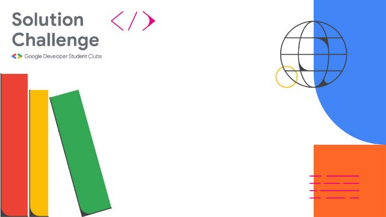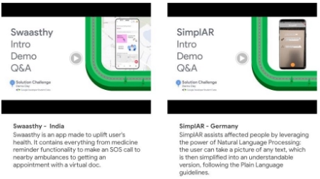

  

Bakhtiyarpur College of Engineering

**So, what are you waiting for? Register Now. ASAP !!!**

[Click Here to Register ](https://docs.google.com/forms/d/e/1FAIpQLSf_XZPW9XO5BY2cIa0ztLhvnZ1cj9So88FkqZ1ByhdtK1fkeQ/viewform)[Click Here for More Details](https://developers.google.com/community/gdsc-solution-challenge)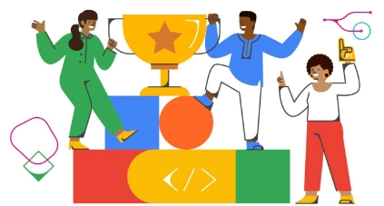

**All The Very Best to all the Paicipants**

*-  Regards GDSC BCE Patna* Touchwoo!!
